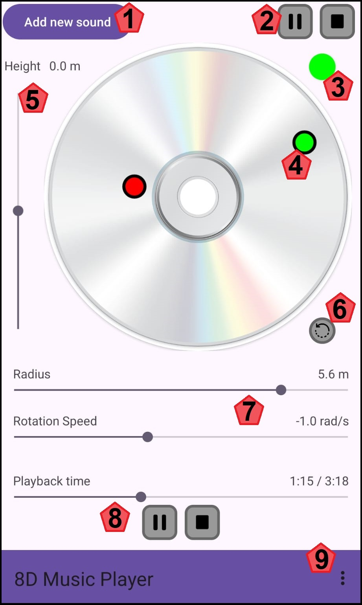
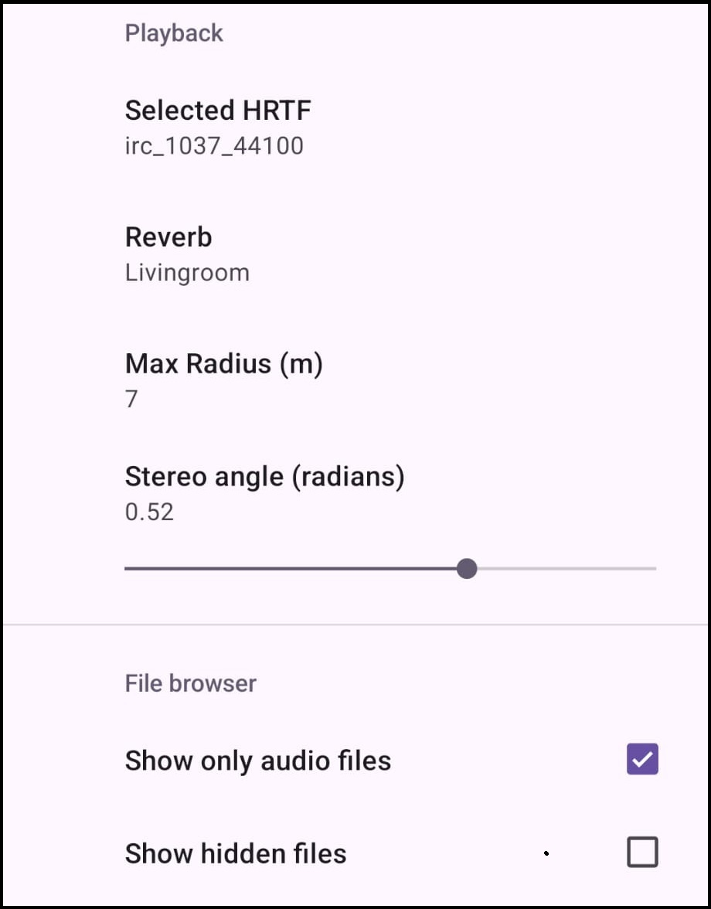
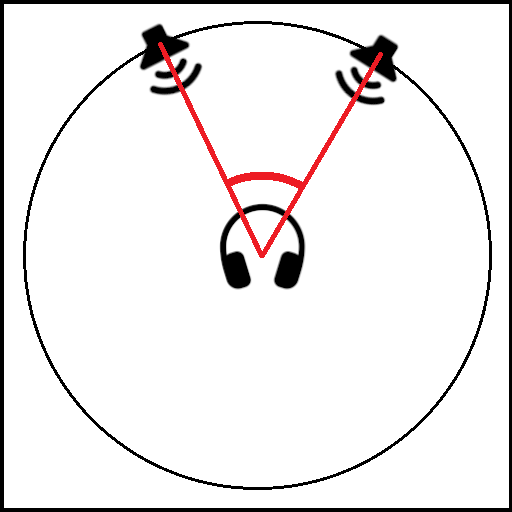

# Help

This page contains all information necessary to use the music player application.

For more information, check out the [project repository](https://github.com/PauHPMCBR/8DMusicPlayer).

## Playback screen

The main screen has the following controls:

1. **Add new sound**: Adds a new sound that starts playing and moving automatically. A valid audio file must be selected from the file chooser. The same file cannot be loaded twice at the same time. New sounds are represented with new circles with different color (for example, right now there are 2 sounds).
2. **Pause/Resume and Stop all buttons**: The first button pauses/resumes all sounds, and the second button stops (removes) all sounds.
3. **Sound select**: Shows the selected sound. Click the button to change selected sound (distinguished by color, right now the "green" sound is selected, and not the "red" one).
4. **Sound position**: Shows the position of a certain sound. The listener is situated in the center of the circle. When touching the part of the screen with the visual circle, the selected sound will follow that position.
5. **Sound Height**: Since a circle is 2D and the 3rd dimension is possible to modify as well, this slider is used to show+change the sound vertical axis. "0.0m" means aligned with the listener.
6. **Automatic Movement**: By default, new sounds will start orbiting the listener automatically. When their position is manually changes this behavior stops. This button resumes automatic movement.
7. **Radius and Rotation Speed**: The two parameters that define the automatic rotation. Radius means distance from the listener, and rotation speed can be negative as well (to orbit in the opposite direction).
8. **Playback controls**: Displays the current playback location of the selected sound, and the ability to pause/resume, stop (remove) and change the playback position of the selected sound.
9. **Screen select**: Menu to change from main player screen to settings/preferences screen and vice-versa.

## Settings screen

The settings screen has the following options:

### Playback
- **Selected HRTF**: Selected algorithm to transform input audio to spatial sound. The "best" algorithm depends on a lot of things, specially the shape of each one's ear. That's why it's recommended to look at a [HRTF test](https://www.youtube.com/watch?v=VCXQp7swp5k) to determine which one works best for you.
- **Reverb**: Applied reverb to the spatial sound. Options are the default included ones in `openal-soft`.
- **Max radius**: Sets the radius that would correspond to the edge of the circle of the audio player screen. The bigger the number, the farthest you will be able to place a sound.
- **Stereo angle**: When a sound in stereo is selected, the sound source is split in 2 (left + right). This variable can change the angle between the two sources. The bigger the angle, the less close the sound sources will be. The following image represents what angle is the one getting modified:

### File browser
The default values try to only show useful stuff in the file browser that opens to load a sound. What each option does is self explanatory.

## File locations and set-up
- `alsoft.conf`: Saved in root directory (usually `/storage/emulated/0/alsoft.conf`). Configuration file for openal-soft, used to find HRTFs and set the default reverb.
- **HRTFs**: Saved inside the directory `/storage/emulated/0/hrtf`. Files of type `.mhr` that specify a certain Head Related Transfer Function. More HRTF files can be added in this directory.
